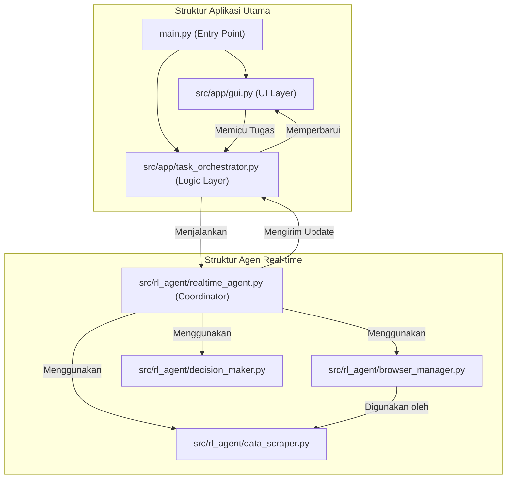

# Rencana Refaktorisasi Aplikasi Game Agent

## 1. Pendahuluan

Dokumen ini menguraikan rencana untuk merefaktor `app.py` dan `src/rl_agent/realtime_agent.py`. Tujuan utamanya adalah untuk meningkatkan modularitas, keterbacaan, dan kemudahan pemeliharaan kode dengan menerapkan *Single Responsibility Principle*. Kami akan memecah kelas-kelas "Dewa" menjadi komponen-komponen yang lebih kecil dan lebih fokus.

## 2. Diagram Arsitektur

### Arsitektur Saat Ini

```mermaid
graph TD
    subgraph "app.py (Monolith)"
        A[UI (Tkinter)]
        B[Manajemen State]
        C[Orkestrasi Thread]
        D[Logging UI]
    end

    subgraph "realtime_agent.py (Monolith)"
        E[Manajemen Browser (Selenium)]
        F[Scraping Data]
        G[Logika Keputusan (RL)]
        H[Manajemen State Agen]
    end

    A -- Mengontrol --> C
    C -- Menjalankan --> F_Agent["RealtimeAgent (Monolithic)"]
    F_Agent -- Mengirim Update --> B
    B -- Memperbarui --> A
```

### Arsitektur yang Diusulkan



## 3. Refaktorisasi `app.py`

`app.py` akan dipecah menjadi tiga file di dalam direktori baru `src/app/`:

*   **`src/app/gui.py`**:
    *   **Tanggung Jawab:** Semua kode yang berhubungan dengan Tkinter. Ini termasuk kelas `App`, `PageBase`, `PageDashboard`, dll. Tanggung jawabnya murni untuk presentasi dan menangkap input pengguna.
    *   **Interaksi:** Akan memanggil metode di `TaskOrchestrator` ketika tombol ditekan. Ia menerima pembaruan data melalui antrian (`queue`) untuk ditampilkan di UI.

*   **`src/app/task_orchestrator.py`**:
    *   **Tanggung Jawab:** Mengelola logika aplikasi non-UI. Ini termasuk membuat dan mengelola *thread* untuk tugas-tugas latar belakang (training, evaluasi, agen). Ini juga akan mengelola instance `RealtimeAgent`.
    *   **Interaksi:** Dipanggil oleh `gui.py`. Ini akan memulai `RealtimeAgent` dan meneruskan `gui_queue` untuk komunikasi.

*   **`main.py`** (di root direktori):
    *   **Tanggung Jawab:** Titik masuk aplikasi yang baru. Tugasnya hanya mengimpor `App` dari `gui.py` dan `TaskOrchestrator` dari `task_orchestrator.py`, menginisialisasi keduanya, dan memulai `mainloop` Tkinter.

## 4. Refaktorisasi `src/rl_agent/realtime_agent.py`

Kelas `RealtimeAgent` akan dipecah menjadi beberapa kelas yang lebih spesifik:

*   **`src/rl_agent/browser_manager.py`**:
    *   **Tanggung Jawab:** Mengelola siklus hidup `webdriver` Selenium. Ini akan menangani inisialisasi driver, login, navigasi ke halaman game, logout, dan penanganan pop-up dasar.
    *   **Metode Utama:** `login()`, `navigate_to_game()`, `logout()`, `get_driver()`, `close()`.

*   **`src/rl_agent/data_scraper.py`**:
    *   **Tanggung Jawab:** Semua logika *scraping* data. Ini akan menggunakan instance `BrowserManager` untuk berinteraksi dengan browser.
    *   **Metode Utama:** `scrape_latest_result()`, `get_current_balance()`, `get_predicting_period()`, `execute_bulk_scrape()`.

*   **`src/rl_agent/decision_maker.py`**:
    *   **Tanggung Jawab:** Logika inti Reinforcement Learning. Kelas ini tidak akan tahu apa-apa tentang Selenium atau web. Ia menerima data, memprosesnya, dan mengembalikan keputusan.
    *   **Metode Utama:** `load_model()`, `get_action(state)`.

*   **`src/rl_agent/realtime_agent.py` (Refactored)**:
    *   **Tanggung Jawab:** Bertindak sebagai koordinator tingkat tinggi. Ia akan menginisialisasi dan menggunakan `BrowserManager`, `DataScraper`, dan `DecisionMaker`.
    *   **Logika:** Akan berisi *main loop* (`run` method), mengelola *state* utama agen (misalnya, `historical_data`, `current_balance`), mengorkestrasi alur kerja (scrape data -> buat keputusan -> eksekusi tindakan), dan menangani logika pemulihan sesi.

## 5. Langkah Implementasi

1.  Buat struktur direktori baru: `src/app/`.
2.  Buat file-file kosong yang diusulkan: `src/app/gui.py`, `src/app/task_orchestrator.py`, `main.py`, `src/rl_agent/browser_manager.py`, `src/rl_agent/data_scraper.py`, `src/rl_agent/decision_maker.py`.
3.  Pindahkan kode secara bertahap dari `app.py` ke `src/app/gui.py` dan `src/app/task_orchestrator.py`.
4.  Pindahkan kode dari `src/rl_agent/realtime_agent.py` ke kelas-kelas baru yang sesuai.
5.  Refaktor `RealtimeAgent` yang asli untuk menjadi koordinator.
6.  Perbarui `main.py` untuk menjalankan aplikasi dengan struktur baru.
7.  Uji secara menyeluruh untuk memastikan semua fungsionalitas tetap berjalan seperti yang diharapkan.